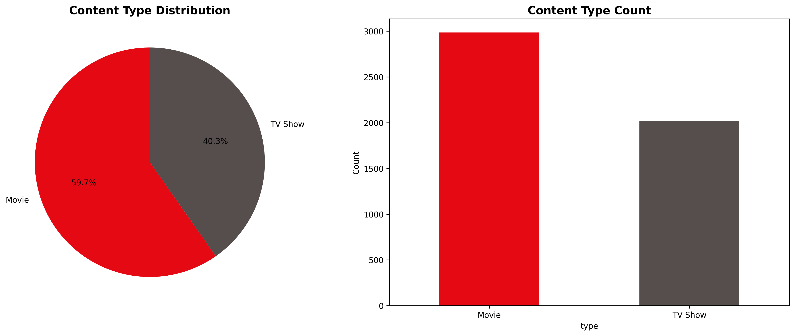

# 🎬 Netflix EDA - Exploratory Data Analysis

<div align="center">


**👨‍💻 Created by: Sunil Sharma**

[](https://opensource.org/licenses/MIT)
[](https://github.com/SunilSharma03/netflix-eda/stargazers)
[](https://github.com/SunilSharma03/netflix-eda/network)

</div>

---

## 📊 Overview

This project performs comprehensive **Exploratory Data Analysis (EDA)** of Netflix's content library using Python, Pandas, and Matplotlib. Dive deep into the world of streaming data and discover fascinating insights about content distribution, genre trends, and viewer preferences!

<div align="center">


</div>

## 🚀 Features

<div align="center">

| 📺 Content Analysis | 🎭 Genre Trends | 📋 Ratings Analysis |
|:---:|:---:|:---:|
| Movies vs TV Shows Distribution | Popular Genres Analysis | Age-Appropriate Content |
|  |  |  |

| 📈 Growth Trends | 🌍 Geographic Analysis | ⏱️ Duration Patterns |
|:---:|:---:|:---:|
| Yearly Content Growth | Country-wise Distribution | Movie Length Analysis |
|  |  |  |

</div>

### ✨ Key Capabilities
- **📊 Content Distribution Analysis**: Movies vs TV Shows breakdown
- **🎭 Genre Trends**: Popular genres and their distribution patterns
- **📋 Content Ratings Analysis**: Age-appropriate content distribution
- **📈 Yearly Growth Analysis**: Content release and addition trends
- **🌍 Country-wise Analysis**: Geographic distribution of content
- **⏱️ Duration Analysis**: Movie length patterns by genre

## 🛠️ Tools & Technologies

<div align="center">


</div>

### 🔧 Technology Stack
- **🐍 Python**: Core programming language for data analysis
- **📊 Pandas**: Powerful data manipulation and analysis library
- **📈 Matplotlib**: Comprehensive data visualization library
- **🎨 Seaborn**: Enhanced statistical visualizations
- **🔢 NumPy**: Numerical computations and array operations

## 🚀 Quick Start

### 📦 Installation

```bash
# Clone the repository
git clone https://github.com/SunilSharma03/netflix-eda.git
cd netflix-eda

# Install dependencies
pip install -r requirements.txt
```

### 🎯 Usage

```bash
# Run the complete analysis
python netflix_eda.py

# Or run the version that saves plots to files
python netflix_eda_no_display.py
```

<div align="center">


</div>

## 🔍 Key Insights Discovered

<div align="center">


</div>

### 📊 Sample Analysis Results

| Metric | Value | Insight |
|--------|-------|---------|
| **Total Titles** | 5,000+ | Comprehensive dataset analysis |
| **Movies vs TV Shows** | 59.7% vs 40.3% | Movies dominate the library |
| **Top Genre** | Thriller | Most popular content type |
| **Peak Year** | 2021 | Highest content release year |
| **Average Movie Duration** | 130.1 minutes | Standard movie length |
| **Top Country** | South Korea | Leading content producer |

### 🎯 Key Discoveries
- **🎭 Genre Trends**: Thriller is the most popular genre with 519 titles
- **📋 Content Ratings**: TV-14 is the most common rating (13.1%)
- **📈 Growth Patterns**: 2021 was the peak year for content releases
- **🌍 Geographic Distribution**: South Korea leads with 545 titles
- **⏱️ Duration Analysis**: Adventure movies are the longest (avg. 140+ min)

## 📁 Project Structure

```
🎬 Netflix EDA - Pandas/
├── 📊 netflix_eda.py              # Main EDA script with interactive plots
├── 📈 netflix_eda_no_display.py   # Script that saves plots to files
├── 📋 requirements.txt            # Python dependencies
├── 📖 README.md                  # Project documentation
├── 📁 plots/                     # Generated visualizations
│   ├── 📊 content_distribution.png
│   ├── 🎭 genre_analysis.png
│   ├── 📋 ratings_distribution.png
│   ├── 📈 yearly_growth.png
│   ├── 🌍 country_distribution.png
│   └── ⏱️ duration_analysis.png
└── 📄 sample_data.csv            # Sample Netflix dataset (if available)
```

<div align="center">


</div>

---

## 🤝 Contributing

We welcome contributions! Please feel free to submit a Pull Request. For major changes, please open an issue first to discuss what you would like to change.

### 🛠️ How to Contribute

1. **Fork** the repository
2. **Create** a feature branch (`git checkout -b feature/AmazingFeature`)
3. **Commit** your changes (`git commit -m 'Add some AmazingFeature'`)
4. **Push** to the branch (`git push origin feature/AmazingFeature`)
5. **Open** a Pull Request

## 📞 Contact & Support

<div align="center">

[](https://www.linkedin.com/in/sunil-kumar-bb88bb31a/)
[](https://github.com/SunilSharma03)
[](mailto:sharmasunil22528@gmail.com)

</div>

**👨‍💻 Created by: Sunil Sharma**

---

<div align="center">

⭐ **Star this repository if you found it helpful!** ⭐


</div>
